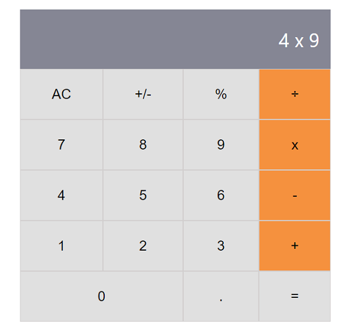
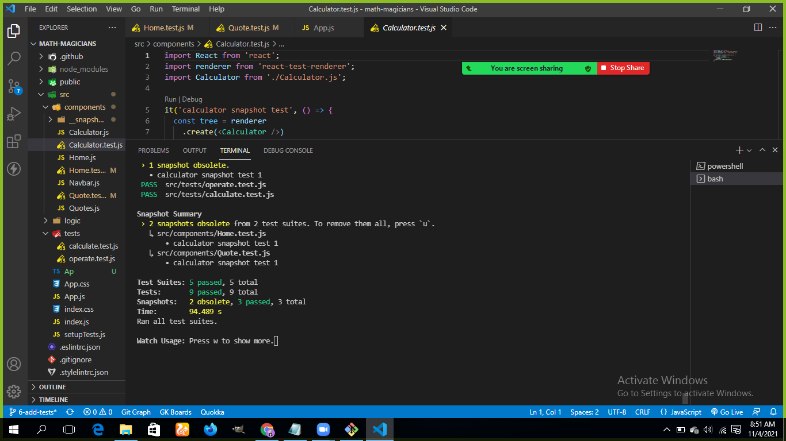

# Math Magicians

> Math magicians is a SPA (single page application) created with react. It uses components to display the UI and to implement the math logic. 




Test



## Built With

- Major languages: HTML, CSS, Javascript
- Frameworks: React
- Technologies used: Webpack, babel

## Live Demo

[Live Demo Link](https://livedemo.com)


## Getting Started

1. To get a local copy up and running follow these simple steps.
```bash
git@github.com:Fikerte-T/math-magicians.git
```
2. To install npm, run the following command in your terminal, in the project directory
```bash
npm install
```
3. To run the app in the development mode
 ```bash
 npm start
 ```
Open [http://localhost:3000](http://localhost:3000) to view it in the browser.

## Author

👤 **Fikerte T.**

- GitHub: [@Fikerte-T](https://github.com/Fikerte-T)
- Twitter: [@tofikertesfaye](https://twitter.com/tofikertesfaye)
- LinkedIn: [LinkedIn](https://www.linkedin.com/in/fikerte-tesfaye-a68337216/)

## 🤝 Contributing

Any feature requests and contributions are welcome!!

Check the issues page [here](https://github.com/Fikerte-T/math-magicians/issues).

## Show your support

Give a 👍 👍 if you approve this project!


## Acknowledgments

- [Create React App documentation](https://github.com/facebook/create-react-app#create-react-app--)

## 📝 License

This project is [MIT](./MIT.md) licensed.
# Getting Started with Create React App

This project was bootstrapped with [Create React App](https://github.com/facebook/create-react-app).

## Available Scripts

In the project directory, you can run:

### `npm start`

Runs the app in the development mode.\
Open [http://localhost:3000](http://localhost:3000) to view it in the browser.

The page will reload if you make edits.\
You will also see any lint errors in the console.

### `npm test`

Launches the test runner in the interactive watch mode.\
See the section about [running tests](https://facebook.github.io/create-react-app/docs/running-tests) for more information.

### `npm run build`

Builds the app for production to the `build` folder.\
It correctly bundles React in production mode and optimizes the build for the best performance.

The build is minified and the filenames include the hashes.\
Your app is ready to be deployed!

See the section about [deployment](https://facebook.github.io/create-react-app/docs/deployment) for more information.

### `npm run eject`

**Note: this is a one-way operation. Once you `eject`, you can’t go back!**

If you aren’t satisfied with the build tool and configuration choices, you can `eject` at any time. This command will remove the single build dependency from your project.

Instead, it will copy all the configuration files and the transitive dependencies (webpack, Babel, ESLint, etc) right into your project so you have full control over them. All of the commands except `eject` will still work, but they will point to the copied scripts so you can tweak them. At this point you’re on your own.

You don’t have to ever use `eject`. The curated feature set is suitable for small and middle deployments, and you shouldn’t feel obligated to use this feature. However we understand that this tool wouldn’t be useful if you couldn’t customize it when you are ready for it.

## Learn More

You can learn more in the [Create React App documentation](https://facebook.github.io/create-react-app/docs/getting-started).

To learn React, check out the [React documentation](https://reactjs.org/).

### Code Splitting

This section has moved here: [https://facebook.github.io/create-react-app/docs/code-splitting](https://facebook.github.io/create-react-app/docs/code-splitting)

### Analyzing the Bundle Size

This section has moved here: [https://facebook.github.io/create-react-app/docs/analyzing-the-bundle-size](https://facebook.github.io/create-react-app/docs/analyzing-the-bundle-size)

### Making a Progressive Web App

This section has moved here: [https://facebook.github.io/create-react-app/docs/making-a-progressive-web-app](https://facebook.github.io/create-react-app/docs/making-a-progressive-web-app)

### Advanced Configuration

This section has moved here: [https://facebook.github.io/create-react-app/docs/advanced-configuration](https://facebook.github.io/create-react-app/docs/advanced-configuration)

### Deployment

This section has moved here: [https://facebook.github.io/create-react-app/docs/deployment](https://facebook.github.io/create-react-app/docs/deployment)

### `npm run build` fails to minify

This section has moved here: [https://facebook.github.io/create-react-app/docs/troubleshooting#npm-run-build-fails-to-minify](https://facebook.github.io/create-react-app/docs/troubleshooting#npm-run-build-fails-to-minify)
